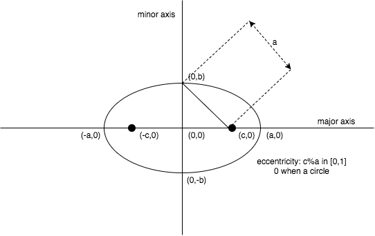
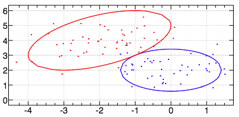
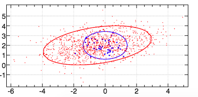
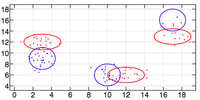
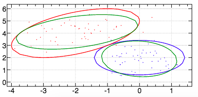
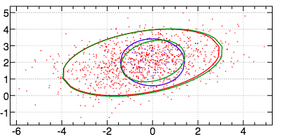
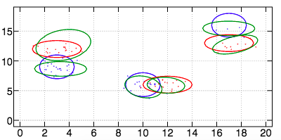
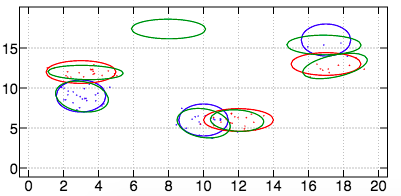

```
0 : 0
Copyright 2018 Pierre-Edouard Portier
peportier.me

Licensed under the Apache License, Version 2.0 (the "License");
you may not use this file except in compliance with the License.
You may obtain a copy of the License at

    http://www.apache.org/licenses/LICENSE-2.0

Unless required by applicable law or agreed to in writing, software
distributed under the License is distributed on an "AS IS" BASIS,
WITHOUT WARRANTIES OR CONDITIONS OF ANY KIND, either express or implied.
See the License for the specific language governing permissions and
limitations under the License.
)

```
# JGMM, Mixture Model in J for Density Estimation and Classification

* Homepage: [peportier.me](http://peportier.me)
* Github: [https://github.com/peportier/jGMM](https://github.com/peportier/jGMM)

This is a derivation of Gaussian [Mixture Model](https://en.wikipedia.org/wiki/Mixture_model) in the [J programming language](http://jsoftware.com/).
It follows the work of [Leonid Perlovsky](https://en.wikipedia.org/wiki/Leonid_Perlovsky) on [Dynamic Logic](http://www.springer.com/fr/book/9783642228292).

## Some basic utilities

```

load 'plot trig numeric'

NB.utils......................................................................

NB. if y is an empty array, return an empty list, otherwise, return y
as_z_=: ]`(($0)"_)@.(0:e.$)
B1_z_=: <"1               NB. rank-1 box
CP_z_=:{@(,&<)            NB. cartesian product

id_z_=: =@i.              NB. identity matrix of size y
MP_z_=: +/ . *            NB. matrix product
det_z_=: -/ . *           NB. determinant
QF_z_=: ] MP"1 [ MP"2 1 ] NB. quadratic form

```

## Multivariate normal distribution

We provide some code to draw data from a multivariate normal distribution.
From the uniform random number generator of `J`, we build a 1-dimensional normal random number generator. The verb `randn` comes from the addon `math/mt/rand.ijs`.

We follow a ["widely used method"](https://en.wikipedia.org/wiki/Multivariate_normal_distribution#Drawing_values_from_the_distribution) (Wikipedia dixit), to draw random values from a multivariate normal distribution (see verb `randmultin`). The J/Lapack interface is used to compute the Cholesky decomposition of the covariance matrix.

Finally, we compute the coordinates of the 2-sigma concentration ellipse for a 2d normal distribution (see verb `cellipse`). We only compute the points for the positive quadrant and then proceed by symmetry.

An ellipse is a set of points in a plane whose distances from two fixed points (viz. foci) add to a constant. We first consider the equation of an ellipse in standard form (i.e., centred on origin and aligned with the axis of the orthonormal basis).




$$foci: (\pm c,0) \;with\; c>0$$
\\[
\begin{equation*}
\begin{split}
\sqrt{(x+c)^2+y^2}+\sqrt{(x-c)^2+y^2} & = 2a \\
\frac{x^2}{a^2}+\frac{y^2}{b^2} & = 1 \;with\; b=\sqrt{a^2-c^2} \\
y & = \sqrt{\left( 1 - \frac{x^2}{a^2} \right)b^2}
\end{split}
\end{equation*}
\\]

The verb `el` implements this last equation to compute the ordinate of an ellipse in standard form.

The standard form equation of an ellipse can be written in matrix notation:
\\[1=\frac{x^2}{a^2}+\frac{y^2}{b^2} = 
\begin{bmatrix}x & y\end{bmatrix}
\begin{bmatrix}
\frac{1}{a^2} & 0 \\
0 & \frac{1}{b^2}
\end{bmatrix}
\begin{bmatrix}x \\ y\end{bmatrix} =
X^T \Lambda \, X\\]

To model a generic 2d ellipse, we can start from a standard form one to which we apply a linear transformation combining translation, scaling and rotation. For convenience of notation, we will note the scaling factor $\sqrt{k}$, the translation vector $M$ and the rotation matrix $R$:

\\[
\begin{equation*}
\begin{split}
\tilde{X} & = M + \sqrt{k} RX \\
X & = \sqrt{k}^{-1} R^T (\tilde{X}-M)
\end{split}
\end{equation*}
\\]

Thus, applying the linear transformation to the equation of the ellipse, we have:

\\[
\begin{equation*}
\begin{split}
X^T \Lambda \, X & = 1 \\
\sqrt{k}^{-2} (\tilde{X}-M)^T R \Lambda R^T (\tilde{X}-M) & = 1 \\
(\tilde{X}-M)^T R \Lambda R^T (\tilde{X}-M) & = k \;(Eq.1)\\
\end{split}
\end{equation*}
\\]

Let us introduce the probability density function of a 2d normal distribution with covariance $C$ and mean $M$. We use the notation $D$ (like "Difference") for $X-M$.
$$G(X) = \frac{1}{2\pi \sqrt{det C}} \; exp \left[ -\frac{1}{2} D^T C^{-1} D \right]$$

The equation for the set of points of equal density is the one of an ellipse:

\\[
\begin{equation*}
\begin{split}
& \;\;\;\;\; \left\{ X: G(X) = k_1 \right\} \\
&= \left\{ X: D^T C^{-1} D = k \right\} \; with \; k=-2ln\left(2\pi k_1 \sqrt{det C}\right) \;(Eq.2)
\end{split}
\end{equation*}
\\]

Matching $(Eq.1)$ and $(Eq.2)$, we have: $C^{-1} \leftrightarrow R \Lambda R^T$, or equivalently: $C \leftrightarrow R \Lambda^{-1} R^T \; (Eq.3)$ (given that the inverse of an orthogonal matrix, here the rotation matrix, is its transpose).
Therefore, to draw the concentration ellipse, we compute the eigen decomposition of the inverse of the covariance matrix. Then, we compute the coordinates of the standard form ellipse (the diagonal elements of $\Lambda$ are $1/a^2$ and $1/b^2$) and we transform it with a scaling factor $\sqrt{k}$, a rotation $R$ and a translation $M$.

Given a vector $v$, the projection of the data $X$ on $v$ is $v^T X$. The variance of the projected data is $v^T C v$ (see this very nice blog post about a [geometric interpretation of the covariance matrix](http://www.visiondummy.com/2014/04/geometric-interpretation-covariance-matrix/)). The $v$ maximising the covariance of the projected data is the largest eigenvector of $C$ (see this [straightforward derivation](https://en.wikipedia.org/wiki/Rayleigh_quotient#Formulation_using_Lagrange_multipliers) based on the method of Lagrange multipliers).

Therefore, citing the [aforementioned article](http://www.visiondummy.com/2014/04/geometric-interpretation-covariance-matrix/): 
> [...]the largest eigenvector of the covariance matrix always points into the direction of the largest variance of the data, and the magnitude of this vector equals the corresponding eigenvalue. The second largest eigenvector is always orthogonal to the largest eigenvector, and points into the direction of the second largest spread of the data.

From $(Eq.3)$, we have that $a^2$ is the magnitude of the vector that points into the direction of the largest variance which is also, by definition, $\sigma_x^2$, the square of the standard deviation. Thus, we understand why we are speaking of the $\sqrt{k}\sigma$-concentration ellipse. The code below (see verb `cellipse`), computes the $2\sigma$-concentration ellipse.

```

NB.RandN......................................................................

NB. draw values from a multivariate normal distribution
NB. with mean vector M and covariance matrix C
NB. find coordinates of the 2-sigma concentration ellipse
coclass 'RandN'

randu=: (?@$&0) :((p.~ -~/\)~ $:) NB. Uniform distribution U(a,b) with support (a,b)
rande=: -@^.@randu : (* $:) NB. Exponential distribution E(μ) with mean μ
randn=: (($,) +.@:(%:@(2&rande) r. 0 2p1&randu)@>.@-:@(*/)) : (p. $:) NB. Normal distribution N(μ,σ^2) of real numbers

require 'math/lapack'
require 'math/lapack/potrf'
chol=: potrf_jlapack_
require 'math/lapack/geev'
eig=: geev_jlapack_

create=: monad define
('M';'C')=:y
update''
)

destroy=: codestroy

update=: monad define
IC=: %. C             NB. inverse of the covariance matrix
CC=: chol C           NB. cholesky decomposition of the covariance matrix
t=. eig IC
L=: (>1{t) * id #C    NB. eigen values on a diag matrix
R=: >0{t              NB. rotation matrix (eigen vectors) IC -: R mp L mp |:R
)

NB. https://en.wikipedia.org/wiki/Multivariate_normal_distribution#Drawing_values_from_the_distribution
NB. y random vectors of a #M-dimensional multivariate normal distribution
randmultin=: 3 : 'M +"1 CC MP"(_ 1) randn y , #M'

el=: dyad define NB. ordinate of an ellipse in std form
'a b'=. x
%: (*:b) * 1 - (*:y) % *:a
)

cellipse=: monad define NB. concentration ellipse at (%:k)-sigma
'u v'=. L MP 1#~#C             NB. std form ellipse (u -: %*:a) *. (v -: %*:b)
                               NB. 1 -: (u**:x) + v**:y
k=. 4
'a b'=. %: % u,v               NB. ellipse with axis a and b
elab=. (a,b)&el
n=. 10                         NB. half the number of points in the positive quadrant
absc0x=. }. steps 0 , a , +:n  NB. abscisses of the points in the positive quadrant
ordi0x=. elab absc0x           NB. ordinate of the points in the positive quadrant
absc=. (|. - absc0x) , 0 , absc0x
orditop=. (|. ordi0x) , (elab 0) , ordi0x
ordiall=. orditop , - |. orditop
coord=. (absc , |. absc) ,"0 ordiall
ncoord=. M +"1 (%:k) * R MP"(2 1) coord NB. transform the std form ellipse into the new basis defined by M and IC
<"1 |: ncoord
)

cocurrent 'base'

```

## Dataset generation

Follows some simple code to make a dataset where each point comes from one of many Gaussian distributions. The Gaussian distributions are organised into disjoint classes. The Gaussian distributions forming a class are called its modes. We also generate a "teacher", i.e. a given number of points for which the class is known *a priori*. This knowledge can be used by the mixture model algorithm that will be derived in the following sections.

```

NB.GMM.......................................................................

NB. make a multivariate normal distribution with mean 1{y and covariance 2{y
NB. draw 0{y objects from this distribution
mkobj=: dyad define
('n',":x)=: conew 'RandN'
n=. ". 'n',":x
create__n }.y
('x',":x)=: randmultin__n >{.y
)

mkdataset=: monad define
isomode=. i.#y
isomode mkobj"0 1 y
X=: ". }: , ([: ,&',' [: 'x'&, ":)"(0) isomode
perm=: ?~ #X
X=: perm { X NB. random permutation of the dataset
truth=: perm { isomode #~ ". }: , ([: ,&'),' [: '(#x'&, ":)"(0) isomode
)

initdataset=: monad define
mode=: ;class
iclass=: (mode&-.)each class NB. modes not in a class ("Inverse" of class) 
K=: #mode
dim=:{:$X
)

NB. y is a boxed list of the number of examples known a priori for each class
initteacher=: monad define
rsel=. [ {~ ] ? #@[ NB. random selection of y elements of x
teacher=: (truth&([: I. [: +./ ="1 0)each class) rsel each y
)

dataset1=: 3 : 0 
mkdataset (50;(0 2);2 2$0.5 0 0 0.5),:(50;(_2 4);2 2$1 0.5 0.5 1)
nbclass=: 2
trueclass=: class=: (,0);(,1)
initdataset''
initteacher (0;0)
)

dataset2=: 3 : 0 
mkdataset (50;(0 2);2 2$0.5 0 0 0.5),:(1000;(_0.5 2);2 2$3 0.6 0.6 1)
nbclass=: 2
trueclass=: class=: (,0);(,1)
initdataset''
initteacher (10;0)
)

dataset3=: 3 : 0
mkdataset (25;( 3  9);2 2$0.5 0 0 1),(20;(10  6);2 2$0.5 0 0 1),(5;(17 16);2 2$0.5 0 0 1),(20;( 3 12);2 2$1 0 0 0.5),(20;(12  6);2 2$1 0 0 0.5),:(10;(17 13);2 2$1 0 0 0.5)
nbclass=: 2
trueclass=: class=: (0 1 2);(3 4 5)
initdataset''
initteacher (25;25)
)

end0=: monad define
n=. ". 'n',":y
destroy__n''
)

end=: monad define
end0"0 ;trueclass
)

```

## Plotting the dataset in case of 2d Gaussian models

```

class_color=:'blue';'red'
class_style=:'markersize 0.1';'markersize 0.1'

plot_class=: monad define
color=: >y{class_color
style=: >y{class_style
plot_mode"0 >y{trueclass
)

plot_mode=: monad define
obj=. ". 'n',":y
dat=. ". 'x',":y
pd 'color ',color
pd 'type line ; pensize 3'
pd cellipse__obj''
pd 'type marker ; markers circle'
pd style
pd <"1 |: dat
)

plot_dataset=: monad define
pd 'reset'
plot_class"0 i.#trueclass
pd 'show'
)

```

For example, here is an image of the dataset generated by the verb `dataset1`:


And an image of the dataset generated by the verb `dataset2` (where the marker size for the first class has been increased to make this highly imbalanced dataset more visible):


And an image of the dataset generated by the verb `dataset3` (this dataset is made of two classes, each class being made of three modes):


## Gaussian Mixture Model

We assume that the data $X$ can be modelled by a deterministic parametric model (or *Hypothesis*) $H(S)$ (where $S$ are the parameters of $H$). More precisely, let say that we have $K$ *a priori* models $H_k(S_k)$ which are processes that could have generated the observed data $X$. We would like to define a similarity between data point $X_n$ and model $H_k$. We note this similarity $l(n|k)$. The sum of the similarities of a point with each of the $K$ models is named its *likelihood* and is written $l(n)=\sum_k l(n|k)$. For a more convenient derivation and for avoiding some problems of numerical precision, we may also use the log-likelihood $ll(n)=ln \left[ \sum_k l(n|k) \right]$. The total likelihood of the dataset $X$ will be the product of the individual likelihoods: $L=\Pi_n l(n)$ or $LL=\sum_n ll(n)$.

Correct values of the parameters are found by reaching a local maximum of $LL$:

\\[
\begin{equation*}
\begin{split}
& \;\;\;\;\; \partial / \partial S_k \sum_n ll(n) &= 0 \\
&= \sum_n \partial / \partial S_k ln(l(n)) &= 0 \\
&= \sum_n \left[ 1/l(n) \right] \partial / \partial S_k \left[ \sum_{k'} l(n|k') \right] &= 0 \\
&= \left\{ \partial / \partial S_k \left[ \sum_{k'} l(n|k') \right]= \partial / \partial S_k l(n|k) \; and \; \partial y = y \partial ln(y)\right\} \\
& \;\;\;\;\; \sum_n \left[ l(n|k) / l(n) \right] \partial ll(n|k) / \partial S_k &= 0 \\
&= \left\{ f(k|n) = l(n|k) / l(n) \right\} \\
& \;\;\;\;\; \sum_n f(k|n) \; \partial ll(n|k) / \partial S_k &= 0
\end{split}
\end{equation*}
\\]

$f(k|n)$ is a *fuzzy class membership*. This is an idea from L. Perlovsky who described the optimisation process as a movement from high fuzzy class membership and uncertain values of parameters $S_k$ to crisp class membership and known values of parameters.

Remark that $f(k|n) \in [0,1]$ while $l(n|k) \in [0,\infty]$ since, as we will soon see, the similarity is most often modelled with a probability density function (PDF) and the value of a PDF at a given point is the relative likelihood that the value of the random variable would equal the value of that point.

$f(k|n)$ measures how likely it is that model $k$ is a source of observed data $X_n$. While $l(n|k)$ measures the likelihood of observing data $X_n$ given that it came from a process modelled by $H_k$.

By modelling the similarity $l(n|k)$ as a joint likelihood of data $X_n$ and model $H_k$, the optimisation problem can be set in the context of a maximum likelihood (ML) estimation. This is interesting since ML is asymptotically unbiased and efficient. Meaning that *with enough data* (viz. *asymptotically*), usually a few points per model parameters, *on average* the estimated parameters attain their true value (viz. *unbiased*), with the average error of estimated parameters attaining the lowest possible values (i.e., the [Cramer-Rao lower bound](https://en.wikipedia.org/wiki/Cram%C3%A9r%E2%80%93Rao_bound)) (viz. *efficient*). Thus, we have:

$$ l(n|k) = pdf(X_n,H_k) = P(k) \; pdf(X_n|H_k) $$

In this derivation, $P(k)$, the prior probability for model $H_k$ to generate a point, is considered constant. It is the proportion of observed data points from class $k$. We note it $r_k$ ($r$ for *rate*). We impose that each observation must have been produced by one of the models. Therefore, $\sum r_k = 1$.

We now consider the case of $pdf(X_n|H_k)$ being modelled by a Gaussian density with mean $M_k$ and covariance $C_k$ (both of which are in that case the parameters $S_k$ of model $H_k$):

\\[
\begin{equation*}
\begin{split}
pdf(X_n|H_k) &= G \left[ X_n | M_k, C_k \right] \\
G \left[ X_n | M_k, C_k \right] &= (2\pi)^{-d/2} (det C_k)^{-1/2} exp \left( -0.5 D^{T}_{nk} C^{-1}_k D_{nk} \right) \\
D_{nk} &= X_n - M_k
\end{split}
\end{equation*}
\\]

In this context, the likelihood of an individual observation is:

$$l(n) = \sum_k l(n|k) = \sum_k pdf(X_n,H_k) = pdf(X_n) = \sum_k r_k G \left[ X_n | M_k, C_k \right]$$

And the total likelihood is:

$$L = \Pi_k \left[ \sum_k r_k G \left[ X_n | M_k, C_k \right] \right]$$

The Lagrange multiplier method is used to take into account the normalisation constraint on the class rates $r_k$ (viz. $\sum r_k = 1$):

$$\tilde{LL} = \sum_n ln \left[ \sum_k r_k G \left[ X_n | M_k, C_k \right] \right] + \lambda \left( \sum_k r_k - 1 \right)$$

At its maximum, $\tilde{LL}$ is such that:

\\[
\begin{equation*}
\begin{split}
& \;& \partial \tilde{LL} / \partial r_k &= 0 \\
&= \;& \sum_n \left[ 1 / l(n) \right] \partial / \partial r_k \left[ \sum_k r_k  G \left[ X_n | M_k, C_k \right]\right] + \lambda &= 0 \\
&= \;& \sum_n f(k|n) / r_k + \lambda &= 0 \\
&= \;& r_k = - \sum_n f(k|n) / \lambda 
\end{split}
\end{equation*}
\\]

Using the normalisation constraint over the class rates, we can solve for $\lambda$:

\\[
\begin{equation*}
\begin{split}
& \;& \sum_k r_k = 1 \\
&= \;& \sum_k - \sum_n f(k|n) / \lambda = 1 \\
&= \;& \left\{ \sum_k f(k|n) = 1 \right\} \\
& & \lambda = -N 
\end{split}
\end{equation*}
\\]

And thus, 

\\[
\begin{equation*}
\begin{split}
& \;& r_k = \sum_n f(k|n) / N \\
&= \;& \left\{ N_k = \sum_n f(k|n) \;,\; \text{the "number" of observations on object $k$} \right\} \\
& & r_k = N_k / N
\end{split}
\end{equation*}
\\]

We can now solve for $M_k$:

\\[
\begin{equation*}
\begin{split}
& \;& \partial LL / \partial M_k = 0 \\
&= \;& \sum_n f(k|n) \partial \left[ -0.5 D_{nk}^T C_k^{-1}D_{nk} \right] / \partial M_k = 0 \\
&= \;& \sum_n f(k|n) C_k^{-1}D_{nk} = 0 \\
&= \;& \left\{ D_{nk} = X_n - M_k \text{, and eliminate } C_k \right\} \\
& & \sum_n f(k|n) M_k = \sum_n f(k|n) X_n \\
&= \;& M_k = \sum_n f(k|n) X_n / N_k
\end{split}
\end{equation*}
\\]

Finally, we solve for $C_k$:

\\[
\begin{equation*}
\begin{split}
& \;& \partial LL / \partial C_k^{-1} = 0 \\
&= \;& \sum_n f(k|n) \; \partial ll(n|k) / \partial C_k^{-1} = 0 \\
&= \;& \left\{ \partial log(det X) / \partial X = X^{-1T} \text{ see for example matrixcalculus.org} \right\} \\
& &\left\{ \partial a^TXa / \partial X = a a^T\right\} \\
& &\left\{ det(A^n) = det(A)^n \right\} \\
& &\sum_n f(k|n) \left[ 0.5 C_k - 0.5D_{nk}D_{nk}^T \right] = 0 \\
&= \;& \sum_n f(k|n) C_k = \sum_n f(k|n) D_{nk}D_{nk}^T \\
&= \;& Ck = \sum_n f(k|n) D_{nk} D_{nk}^T \; / \; N_k
\end{split}
\end{equation*}
\\]

Given this derivation, the code below for one iteration of the algorithm should be quite straightforward:

```

iter=: monad define
N=: +/"1 F
R=: N % #X
D=: (K#,:X) -"1 M
MLC=: N %~ +/"3 F * */~"1 D NB. max likelihood estimate of the covariances
PC=: C
C=: CSensor sinned} MLC
detC=: det C
sin=: I. (<&detmin +. >&detmax) detC
sinned=: sinned , sin
MSinned=: sinned { M
C=: CSensor sin} C
invC=: %.C
detC=: (det ` (detC"_) @. (0=#sin)) C
exp=: ^ --:1 * invC QF D
PDF=: exp * ((o.2)^--:dim) * %%:detC
F=: (%"1 +/) R*PDF
UF''
PM=: M
M=: MSinned sinned} N %~ +/"2 (K#,:X) *"(3 2) F
tconv=: [: *./@, [ > |@-/@] NB. test convergence
conv=: (1e_1 tconv M,:PM) *. 1e_2 tconv C,:PC
t=: >:t
)

```

The only new aspect of this code is how it deals with a covariance matrix $C_k$ becoming singular (i.e., when its determinant becomes too small or, but it's more rare, too big). In that case, we stop updating the parameter $C_k$ and we fix its value to a covariance matrix corresponding to an estimation of the precision of the sensor. In other words, we fix the value of $C_k$ so that the corresponding $2\sigma$-concentration ellipse covers a small area. We also fix $M_k$ to the value it had when $C_k$ became singular.

Also, we compute how much the parameters changed between two iterations (see noun `conv`) to determine when the maximum likelihood estimation has converged.

The initialisation is also quite simple, apart from the initialisation of the means where we employ the same algorithm used for [`kmeans++`](https://en.wikipedia.org/wiki/K-means%2B%2B). This is a variation on the code available on [`rosettacode.org`](http://rosettacode.org/wiki/K-means%2B%2B_clustering#J). One should notice the elegant `wghtprob` due to [Roger Hui](https://en.wikipedia.org/wiki/Roger_Hui) (see [`http://j.mp/lj5Pnt`](http://j.mp/lj5Pnt)).

```

NB. Compute Initial Means à la kmeans++
CIM=: (],rndcenter)^:(]`(<:@:[)`(,:@:seed@:]))
seed=: {~ ?@#
NB. generate x rnd integers in i.#y with probability proportional to list of weights y
wghtprob=: 1&$: :((% {:)@:(+/\)@:] I. [ ?@$ 0:)"0 1
dist=: +/&.:*:@:-"1
rndcenter=: [ {~ [: wghtprob [: <./ dist/~

init=: monad define
t=:0 NB. time
M=: K CIM X
C0=: (+/%#) */~"1 (] -"1 +/%#) X
('detmin';'detmax')=: (1e_4&* ; 1e4&*) det C0
CSensor=: C0%25 NB. covariance corresponding to the sensor precision
C=: K#,:C0
F=: K#,:(#X)#%K NB. initial Fuzzyness
UF''
NB.F=: (="1 0 /:~@~.) truth NB. perfect teacher
sinned=: $0
conv=:0 NB. convergence, boolean
)

```

At each iteration, we update the fuzzy to crisp association between data and models $f(k|n)$ by incorporating the prior knowledge of the teacher who gives the exact associations for some of the points.

```

NB. Update F, the Fuzzy to crisp association between data and models,
NB. given the prior knowledge of a teacher
UF=: monad define
if. #,>teacher do.
toprob=. [: (%"1+/)@as {
merge=. (<@;)"1 @: |:
tocp=. 1 : '([: ((,@:u) ; (<@,)) CP)"1' NB. apply u to the cartesian product of x and y
m0=. merge > class  (toprob&F) tocp each teacher
m1=. merge > iclass (0:"0)     tocp each teacher
F=: F ((>@{.@])`(>@{:@])`([))} merge m0,:m1
end.
)

```


## Area under the precision-recall curve (PRAUC) and classification entropy (CE)

Once the algorithm converged, we compute the [area under the precision recall curve](http://pages.cs.wisc.edu/~boyd/aucpr_final.pdf). This article is very informative on the difference between the traditional Operating Characteristic curve and the PR curve: [The Relationship Between Precision-Recall and ROC Curves](http://pages.cs.wisc.edu/~jdavis/davisgoadrichcamera2.pdf).

Moreover, since our maximisation of the likelihood by gradient ascent can attain a local maximum, we do multiple runs and we keep the one with minimum *Classification Entropy* ($CE$). $CE$ is the mean over all classes of the log of the classification probability (i.e., posterior Bayes probability) $P(k|n)$ which at convergence is estimated by $f(k|n)$ ($m$ being an index over the modes in class $k$):

$$CE = - \sum_n \sum_k \left[ \sum_m f(k,m|n) \right] ln \left[ \sum_m f(k,m|n) \right]$$

$CE$ attains its minimum (viz. $0$) when the classification is crisp (i.e., $f(k|n) = 0 \text{ or } 1)$).

```

run=: monad define
while. (-.conv) *. t<100 do. iter'' end.
CE=: - +/^:2 > ([: (* ^.) [: +/ {&F) each class NB. classification entropy
PRAUC''
)

PRAUC=: monad define NB. area under the precision-recall curve
LR=:(%"1 +/)PDF NB. likelihood ratios
mask=: 0 (;teacher)} 1 #~ #truth NB. to remove the data points known to the teacher
LR=: mask #"1 LR
class0=: +./ (mask#truth) ="1 0 >{.trueclass
TP=: 3 : '+/(+./ (>0{class) { LR>y) *. class0'
FP=: 3 : '+/(+./ (>0{class) { LR>y) *. -.class0'
FN=: 3 : '(+/class0)-TP y'
precision=: TP % TP + FP
recall=: TP % TP + FN
clean=. (([: ~. {."1) |:@,: {."1 >.//. {:"1) NB. for equal values of recall keep the greater precision
NB. data for the parametric precision-recall curve. For recall 0 the precision is 1.
AUCData=: clean 0 1 ,~ }: (recall,precision)"0 steps 0 1 100
AUC=: +/ 2 (|@-/ (-:@*/@[ + {.@[ * ]) {:@{.)\ AUCData NB. area under the PR curve
NB.'stick,line' plot <"1|:AUCData
)

metarun0=: monad define
init''
run''
('LM';'LC';'LCE';'LAUC')=: (LM,M);(LC,C);(LCE,CE);(LAUC,AUC)
)

metarun1=: monad define
init''
run''
('LM';'LC';'LCE';'LAUC')=: (,: M);(,: C);(,: CE);(,: AUC)
metarun0^:9''
NB. keep the results of the run with minimum classification entropy
('M';'C';'CE';'AUC')=: ((i. <./) LCE)&{ each LM;LC;LCE;LAUC
)

```

## Plotting the estimation

```

plot_estimate=: monad define
n=. conew 'RandN'
create__n (y{M);(y{C)
pd 'color green'
pd 'type line ; pensize 3'
pd cellipse__n''
destroy__n''
)

plot_all=: monad define
pd 'reset'
plot_class"0 i.#trueclass
plot_estimate"0 i.#mode
pd 'show'
)

```

## Adaptive number of modes

Finally, we automatically find the optimal number of modes within a class by minimising the $CE$. Also, we stop increasing the number of modes for a class when one of them covers a too small number of objects.

```

metarun2=: monad define
mkclass=: ([: i. each ;/) +each ([: ;/ 0: , [: }: +/\)
classmask=: 0: = ; @: (i.each) @ ;
modeinc=: nbmode=: nbclass # 1
PCE=: _ [ CE=: 1e6
('BM';'BC';'BCE';'BAUC';'BClass';'BMode')=: 6$a:
nbiter=: 0
while. (0 < +/modeinc) *. (PCE>CE) *. nbiter<10 do.
  class=: mkclass nbmode
  initdataset''
  PCE=: CE
  metarun1''
  ('BM';'BC';'BCE';'BAUC';'BClass';'BMode')=: (BM,<M);(BC,<C);(BCE,<CE);(BAUC,<AUC);(BClass,<class);<(BMode,<mode)
  modeinc=: > *./each (classmask nbmode) (<;.1) N>3 NB. ISO classes whose # of modes can increase
  nbmode=: nbmode + modeinc
  nbiter=: >: nbiter
end.
('M';'C';'CE';'AUC';'class';'mode')=: >@(((i. <./) >BCE)&{) each BM;BC;BCE;BAUC;BClass;<BMode
)

```

## Results

### Dataset 1
For the first dataset, we obtain the following result with an AUCPR of $O.999$ (with no teacher).



### Dataset 2
For the second dataset, we obtain the following result with an AUCPR of $O.175$ (with only $20\%$ of the points used as a teacher). In case of a perfect teacher, the AUCPR would have been $0.211$. Therefore, we attained $83\%$ of the Bayes optimum with prior knowledge of the classes of only $20\%$ of the points.



### Dataset 3

For the third dataset, we obtain the following result with an AUCPR of $O.916$.



In case we don't know the number of modes per class, we can use `metarun2` and we obtain the following result with an AUCPR of $0.965$.



